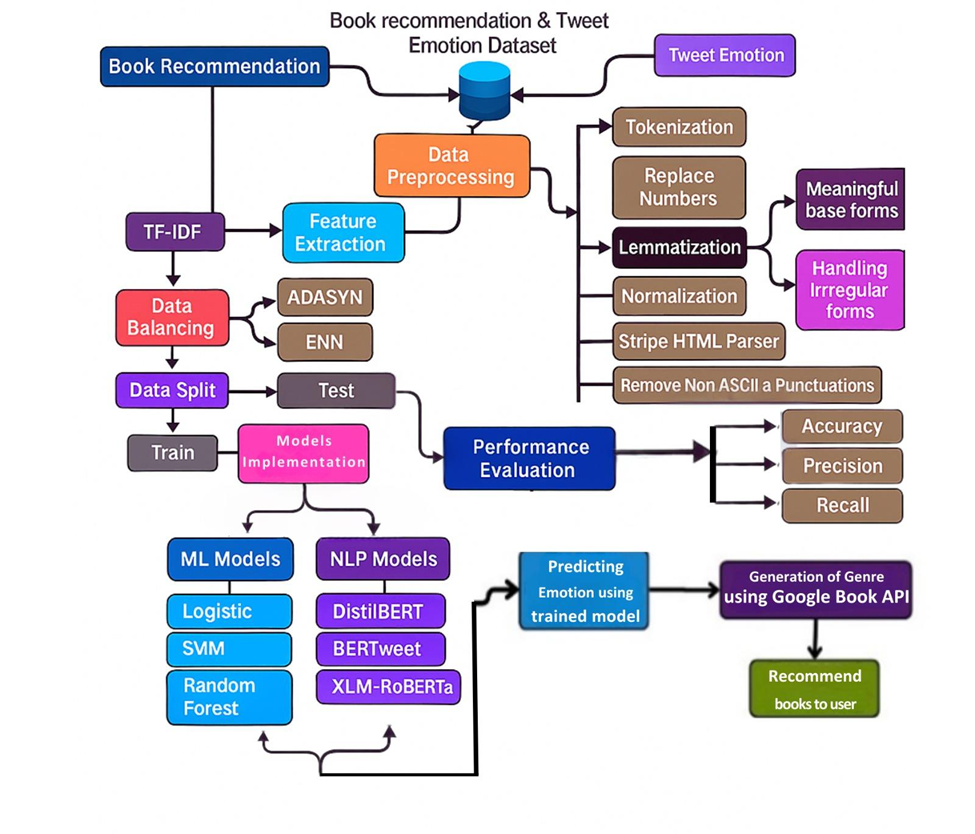
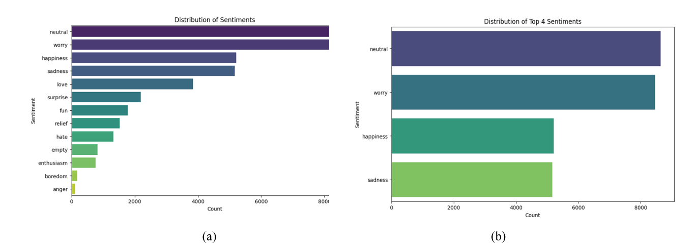
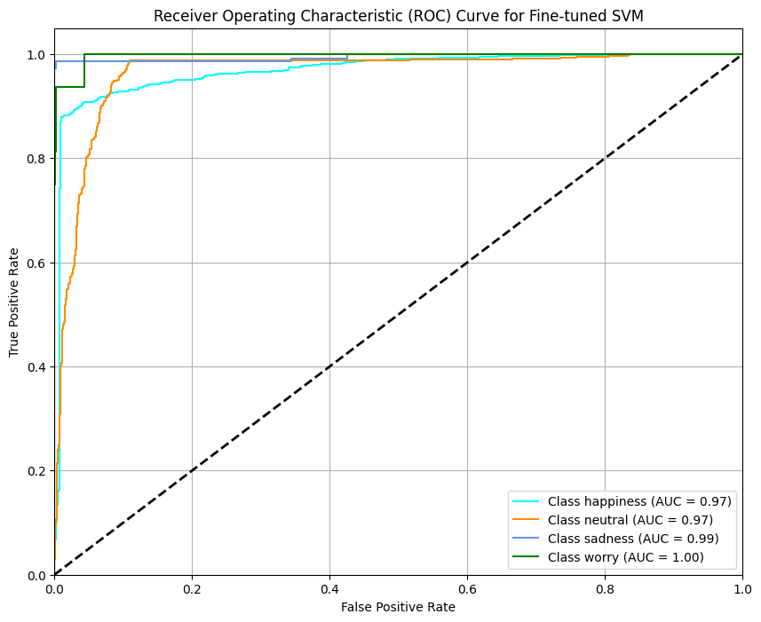
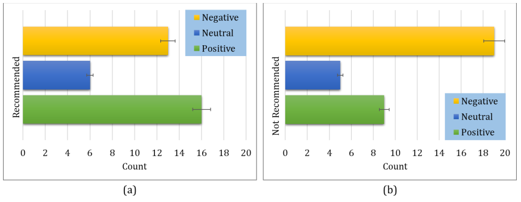

# 📚 Sentiment-Based Book Recommendations Using ML & NLP

A machine learning and natural language processing approach to enhance
reading experiences by identifying specific emotions in textual reviews
and generating emotionally intelligent book recommendations.

> ⚠️ **Research & Educational Use:**  
> This project is intended for research and educational purposes. It
> explores the intersection of affective computing, natural language
> processing, and recommender systems.

---

## 📌 Overview

Traditional sentiment analysis typically distinguishes between neutral,
positive, or negative sentiment. However, emotion analysis goes deeper by
identifying specific affective states expressed in textual content.

This research proposes an emotion-aware book recommendation approach by
combining:

- Emotion detection from user-generated text
- Book review analysis
- Genre prediction
- Natural language processing
- Classical machine learning
- Transformer-based models
- Emotion-aware recommendation

The system processes textual data using advanced NLP techniques, applies
**TF-IDF** for feature extraction, addresses class imbalance using
**ADASYN**, and integrates the **Google Books API** for genre mapping.

---

## 🎯 Objectives

The main objectives of this research project are:

1. Integrate emotion data and book review data to create a contextual
   recommendation system.
2. Implement advanced NLP preprocessing techniques including tokenization,
   lemmatization, and HTML parsing.
3. Address model bias through emotion class reduction and ADASYN-based
   class balancing.
4. Perform comparative evaluation of classical machine learning
   classifiers using stratified k-fold cross-validation.
5. Evaluate pre-trained transformer models for emotion classification.
6. Explore how detected emotional states can be incorporated into book
   recommendation.

---

## 🧾 Datasets

The research utilizes two primary datasets to develop the
emotion-aware recommendation system.

### 1. Tweet Emotion Dataset

The dataset contains **39,716 tweets** with labeled emotions.

The original emotion labels are mapped into four primary classes:

- Happiness
- Neutral
- Sadness
- Worry

This reduced emotion classification is used to create a more manageable
and reliable training setup.

### 2. Book Review Dataset

The book review dataset contains approximately **300,000 Amazon reviews
and ratings** across various books.

The review information is used to investigate the relationship between
textual content, emotional characteristics, and book-related information.

> **Note:** The original datasets are not necessarily included in this
> public repository. Please refer to `data/README.md` for dataset and
> usage information.

---

## 🔍 NLP Features & Preprocessing

Raw textual data undergoes a multi-stage NLP preprocessing pipeline.

### Tokenization & Lemmatization

Text is tokenized and words are reduced to their base or canonical forms
to improve the consistency of the textual representation.

### Noise Removal

The preprocessing pipeline removes unnecessary textual elements,
including:

- HTML tags
- Non-ASCII characters
- Punctuation
- Other unwanted text artifacts

### Text Normalization

The text is normalized through operations such as:

- Contraction replacement
- Number normalization
- Case normalization
- Text cleaning

### Feature Extraction

The processed text is converted into numerical representations using
**Term Frequency-Inverse Document Frequency (TF-IDF)**.

TF-IDF provides a numerical representation of word importance within the
text corpus and is used as an input representation for classical machine
learning models.

---

## ⚖️ Handling Class Imbalance

Emotion datasets may contain an uneven distribution of samples across
different emotion classes.

To address this issue, the project uses:

### Emotion Class Reduction

The original emotion categories are mapped into four primary emotion
classes:

```text
Happiness
Neutral
Sadness
Worry
```

### ADASYN

**ADASYN (Adaptive Synthetic Sampling)** is used to generate synthetic
samples for underrepresented classes.

This helps create a more balanced training dataset and supports more
reliable model evaluation.

---

## 🤖 Machine Learning Models

The project explores both classical supervised machine learning
algorithms and transformer-based NLP models.

### 1. Support Vector Machine (SVM)

Support Vector Machine is used to identify an optimal decision boundary
between emotion classes.

The model maximizes the margin between classes and can utilize kernel
functions for higher-dimensional feature spaces.

According to the research experiments, the fine-tuned and balanced SVM
achieved an accuracy of **96.92%**.

### 2. Random Forest (RF)

Random Forest is an ensemble learning method that combines multiple
decision trees.

It uses bootstrap aggregation and multiple decision trees to improve
robustness and reduce overfitting.

### 3. Logistic Regression (LR)

Logistic Regression is used as a statistical baseline classifier for
emotion prediction.

It estimates the probability of class membership using the logistic
(sigmoid) function.

### 4. Transformer Models

The project also evaluates several pre-trained transformer models:

- **DistilBERT**
- **BERTweet**
- **XLM-RoBERTa**

#### DistilBERT

A lightweight transformer model designed to retain much of BERT's
language understanding capability while reducing computational
requirements.

#### BERTweet

A transformer model optimized for processing user-generated social media
text such as tweets.

#### XLM-RoBERTa

A multilingual transformer model trained on large-scale CommonCrawl
data and evaluated for emotion classification.

---

## 🔬 Model Evaluation

The classical machine learning models are evaluated using:

- Accuracy
- Precision
- Recall
- F1-score
- Stratified K-Fold Cross-Validation
- ROC Curve
- AUC

Comparative evaluation is performed to examine the performance of
different classification approaches.

---

## 📚 Recommendation System

The recommendation component combines detected emotional information
with book-related information to generate emotionally relevant
recommendations.

The general process can be summarized as:

```text
User Text / Review
        ↓
Text Preprocessing
        ↓
Emotion Detection
        ↓
Emotion Classification
        ↓
Book / Review Information
        ↓
Genre Mapping
        ↓
Recommendation Processing
        ↓
Emotion-Aware Book Recommendations
```

The system uses the **Google Books API** to support book and genre
mapping.

---

## 🧠 System Workflow

```text
Tweet Emotion Dataset
        ↓
Text Preprocessing
        ↓
Emotion Class Mapping
        ↓
TF-IDF Feature Extraction
        ↓
Class Balancing with ADASYN
        ↓
Machine Learning Models
        ↓
Emotion Classification
        ↓
Book Review Dataset
        ↓
Book / Genre Mapping
        ↓
Google Books API
        ↓
Recommendation System
        ↓
Emotion-Based Book Recommendations
```

---

## 📉 Visual Analysis

The project includes visualizations for understanding the data,
model performance, and recommendation process.

### Model Workflow & Emotion Distribution

<p align="center">
  
  
</p>

### Model Performance & Recommendations

<p align="center">
  
  
</p>

---

## 🛠️ Technologies

### Programming

- Python

### Natural Language Processing

- Natural Language Processing (NLP)
- Tokenization
- Lemmatization
- TF-IDF
- Text normalization
- HTML parsing

### Machine Learning

- Scikit-learn
- Support Vector Machine
- Random Forest
- Logistic Regression
- ADASYN

### Transformer Models

- DistilBERT
- BERTweet
- XLM-RoBERTa

### Data Processing

- Pandas
- NumPy

### Visualization

- Matplotlib
- Seaborn

### External API

- Google Books API

### Development

- Jupyter Notebook
- Google Colab
- VS Code
- Git

---

## 📊 Research Highlights

- **39,716** labeled tweets used for emotion classification.
- Emotion categories reduced to **four primary classes**.
- Approximately **300,000** book reviews used for book-related analysis.
- **TF-IDF** used for classical machine learning feature extraction.
- **ADASYN** used to address class imbalance.
- Classical models compared using stratified k-fold cross-validation.
- Transformer-based models evaluated for emotion classification.
- Google Books API used for genre and book mapping.
- Emotion information incorporated into the recommendation process.
- Reported SVM accuracy of **96.92%** after fine-tuning and data balancing.

---

## 📁 Project Structure

```text
Sentiment-Book-Recommender/
│
├── data/
│   ├── README.md
│   └── tweet_emotions.csv
│
├── images/
│   ├── bert.png
│   ├── best_ml_model.png
│   ├── distribution_of_sentiments.png
│   ├── recommendation_system.png
│   ├── roc_curve.png
│   └── workflow.png
│
├── README.md
├── Sentiment_Analysis_ML___NLP_.pdf
├── emotion_&_recommendation.ipynb
└── requirements.txt
```

---

## 🚀 Getting Started

### 1. Clone the Repository

```bash
git clone https://github.com/shifat1112/Sentiment-Book-Recommender.git
```

### 2. Navigate to the Project Directory

```bash
cd Sentiment-Book-Recommender
```

### 3. Install Required Libraries

```bash
pip install -r requirements.txt
```

### 4. Run the Notebook

Launch Jupyter Notebook:

```bash
jupyter notebook
```

Then open:

```text
emotion_&_recommendation.ipynb
```

You can also run the notebook using **Google Colab**.

---

## 🔐 Data & Privacy

The project works with publicly sourced textual datasets and
user-generated review data.

The original datasets may contain content obtained from external
sources. Users reproducing this research should verify the applicable
dataset licenses, terms of use, and redistribution restrictions before
using or publishing the data.

The repository should not contain private user information, API
credentials, or other sensitive data.

---

## ⚠️ Limitations

Several limitations should be considered:

- Emotion classification depends on the quality and distribution of the
  training data.
- Emotion labels may not fully represent the complexity of human
  emotional states.
- Class balancing techniques such as ADASYN generate synthetic samples
  and may not perfectly represent real-world language patterns.
- Book recommendations depend on the quality and availability of book
  metadata.
- API-based book information may change over time.
- Transformer models can require significant computational resources.
- Recommendation quality requires further user-level and real-world
  evaluation.

---

## 🔮 Future Work

Potential future improvements include:

- Fine-tuning transformer models on larger emotion datasets.
- Incorporating additional emotion categories.
- Exploring multilingual emotion detection.
- Developing personalized recommendation profiles.
- Combining emotion with user preferences and reading history.
- Incorporating semantic embeddings for recommendation.
- Exploring sentence-transformer-based book representations.
- Evaluating recommendations using user studies.
- Developing a web-based recommendation interface.
- Exploring real-time emotion-aware recommendation.
- Improving explainability of recommendation results.

---

## 📚 Research Context

This project explores the intersection of:

- Affective Computing
- Natural Language Processing
- Emotion Detection
- Machine Learning
- Transformer-Based NLP
- Recommender Systems

The research investigates how emotional information extracted from
text can be incorporated into book recommendation systems to provide
more context-aware recommendations.

---

## 👨‍💻 Author

**Md. Shifat Ahmed**

B.Sc. in Computer Science & Engineering  
Daffodil International University

**Research Interests:**  
Artificial Intelligence • Machine Learning • Natural Language Processing
• Generative AI • Intelligent Systems

---

## 📄 Research Material

The repository also contains the research report:

```text
Sentiment_Analysis_ML___NLP_.pdf
```

The complete implementation and experimental workflow are available in:

```text
emotion_&_recommendation.ipynb
```

---

## ⭐ Acknowledgment

This project was developed for academic and research purposes to explore
emotion-aware recommendation using machine learning and natural language
processing.
